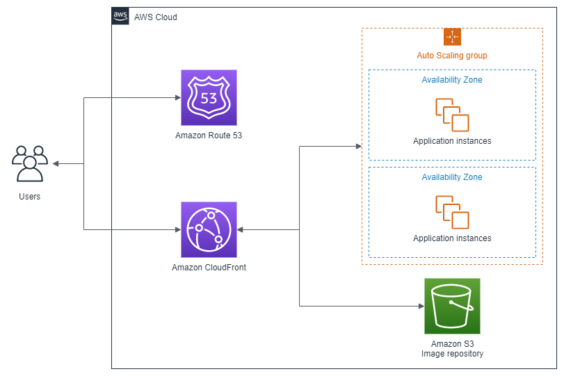

It is hard to imagine the future for medical imaging without machine learning (ML) as its central innovation engine. Countless researchers, developers, start-ups, and larger enterprises are engaged in building, training, and deploying machine learning solutions for medical imaging that are posed to transform today’s medical workflows and the future value of imaging in diagnosis and treatment.

To reach scientific breakthroughs, researchers need first to overcome several obstacles when training and deploying machine learning models. First, they must access large volumes of data stored in disjointed registries that are located in different parts of the world. Second, they need to deploy standardized tools globally to generate ground truth on reference datasets. Finally, they need to configure a secure and cost-effective environment to allow for collaboration between research groups.

That is why Diagnostic Image Analysis Group (DIAG) at the Radboud University Medical Center in Nijmegen, The Netherlands, turned to AWS to migrate their [grand-challenge.org](http://grand-challenge.org) open-source platform from their on-premises data center to the cloud. [Grand-challenge.org](http://grand-challenge.org) was established in 2012 for the organization of machine learning challenges in biomedical image analysis, and today brings together 45,000+ registered researchers and clinicians from all over the world to collaborate on creating novel ML solutions in the field.

When in early March 2020 it was hypothesized that CT imaging could play an important role in the diagnosis and assessment of COVID-19, the Dutch Radiological Society rapidly proposed a standardized assessment scheme for CT scans of patients with suspected COVID-19 called CO-RADS. And radiologists turned to the [grand-challenge.org](http://grand-challenge.org) platform to collect imaging data and to use the platform’s browser-based viewing system for CT scans to assess the performance of the CO-RADS model, which achieved a high discriminatory power for diagnosing COVID-19 from a CT scan alone (ROC 0.91, 95% CI, 0.85-0.97, for positive RT-PCR results)[(1)](https://pubs.rsna.org/doi/10.1148/radiol.2020201473).

On the platform, DIAG has made the COVID-19 dataset, the training course to teach radiologists how to assess a scan using CO-RADS, the exam and the ML model available to all registered users. However, grand-challenge.org was running in an on-premises data center, and the experience of the radiologists using the course outside of Europe was poor due to latency of the server-side rendered viewing systems, and the number of scans DIAG could process with our AI tools was limited by the amount of hardware we provisioned before the emergence of SARS-Cov-2.

In April 2020, the collaboration between DIAG and AWS started to bring globally distributed browser-based viewing systems and elastic scaling to make these tools available to machine learning and clinical researchers worldwide. Through a successful collaboration between DIAG’s Research Software Engineering team and AWS the grand challenge platform was able to be migrated to the cloud in less than two weeks from the start of the project. Several technical hurdles were overcome, resulting in a more robust, performant, and scalable application that will continue to support the medical imaging community during this pandemic and beyond.

This work presents the architecture and services used for the global medical imaging analysis platform and explains the challenges, solutions, and results obtained including 1) exchange data with the global research community, 2) low-latency and scalable web-based viewer, 3) secure and cost-effective deployment & distribution of machine learning models, and 4) rapid migration to cloud of data and compute.

## Exchange data with the global research community

Developing robust machine learning solutions to problems in biomedical imaging requires access to large amounts of annotated training data. The volume of data generated by medical instruments such as MRI and CT scanners, next-generation sequencers, and digital pathology machines steadily increases as sensors become more accurate and systems more sophisticated in characterizing physiology. The massive data generated is locked in siloed databases and proprietary formats. The exchange of data and collaboration on research projects beyond the boundaries of an institution remains a challenge from a technical as well as compliance and security perspective.

On grand-challenge.org DIAG has added functionality so that researchers can set up archives to easily share data with each other, apply algorithms to that data, and set up their own reader studies to invite experts to annotate the data. In medical imaging, shipping HDDs across sites is the norm, but AWS enabled the use of direct upload to Amazon Simple Storage Service ([Amazon S3](https://aws.amazon.com/s3/)) with accelerated transfers to gather data from sites globally. Users are able to upload data in a variety of medical imaging formats including DICOM and a variety of whole slide image formats. These data are automatically validated and converted to MetaImage or TIFF as this is much easier for the machine learning researchers to work with.

Amazon S3 is used to store all of the imaging data on the grand-challenge.org platform. Now, DIAG does not need to worry about scaling the storage after the increased data influx from scans of patients with suspected COVID-19\. To allow for fast access to the data we use Amazon CloudFront and easily integrate URL signing with the Django backend so that users are only able to download the files for the images that they have permission to view.

## Low-latency and scalable web-based viewer

Today, most viewing and processing of medical imaging data in both clinical and research environments happens on-premises on dedicated workstations capable of server-side rendering necessary for routine manipulations such as MIP (maximum intensity projection) viewing or 3D volumetric rendering. With the increased collaboration between radiologists from many institutions spread across the world as well as the rise in secondary usage of medical imaging for research and development of ML solutions, there is a need for globally available solutions.  This very challenge was faced recently by Radboud University Medical Center in Nijmegen as they received great interest from radiologists worldwide for their CO-RADS Academy solution that teaches physicians how to read COVID-19 CT images.

The Diagnostic Image Analysis Group (DIAG) developed a web-based medical imaging viewer called CIRRUS, which is built on MeVisLab from MeVis Medical Solutions. CIRRUS enables the use of many tools that radiologists require for interacting with medical imaging data. Server-side rendering is used for rapid loading of the medical imaging data and allows the use of powerful rendering hardware for 3D multiplanar reformation, pre-loading of series in memory and GPU acceleration. The rendered scenes are streamed to the client over a WebSocket connection to a VueJS single page application to also gain the strengths of client-side interactions where necessary. These workstations are deployed using Docker containers, and one container image is launched per user with the users being routed to their container instance with Traefik.

In this project, DIAG was able to set up rendering servers on AWS in Europe, Japan, and North America on Amazon Elastic Compute Cloud ([Amazon EC2](https://aws.amazon.com/ec2/)). To start the container on-demand for a new user, it takes less than 30sec and we are able to horizontally scale the compute pool by adding additional EC2 instances in each Region. The medical imaging data are stored in an Amazon S3 bucket in Europe. To ensure rapid loading times in North America and the Asia Pacific Regions we used [Amazon CloudFront](https://aws.amazon.com/cloudfront/) to cache the data on demand. The loading performance for a typical 300MB CT, 500 slices CT studies is less than 10 seconds. With a latency of 20ms, there is no observer delay in scrolling, which provides a great user experience.

## Secure and cost-effective deployment & distribution of machine learning models

Researchers need to have the freedom to use whatever tool or library is most appropriate for their use case, and often find it difficult to distribute their models to the rest of the research community. On grand-challenge.org this gap is bridged by allowing researchers to upload their developed model and pre-processing pipeline as a Docker container image, where they can manage the users who can access the algorithm. This allows researchers to share their algorithms with the community, where the platform will handle authentication, authorization, data access, validation and conversion of DICOM to MetaImages, and execution of the containers on the data with GPU acceleration.

The grand-challenge.org platform uses Celery to schedule the jobs for these containers and medical images, providing GPU acceleration where needed with NVIDIA T4 cards. DIAG was able to reduce the number of services it manages by using Amazon Simple Queue Service ([Amazon SQS](https://aws.amazon.com/sqs/)) as the message broker and can now horizontally scale by adding workers that listen to each queue. It is also able to run across its existing provisioned hardware and during periods of increased demand start extra g4dn EC2 instances.

This has enabled researchers to rapidly deploy a model for automated scoring of CT scans with CO-RADS and is available at [https://grand-challenge.org/algorithms/corads-ai/](https://grand-challenge.org/algorithms/corads-ai/). Users are able to upload their own data and receive a prediction on this data within 2 minutes, and then inspect the results in the globally available browser-based workstations.

<small>_Image courtesy of Radboud University Medical Center in Nijmegen_</small>

## Rapid migration to cloud of data and compute

DIAG had previously been running grand-challenge.org in its on-premises data center, and did not foresee the scale at which it would need to operate during this pandemic. However, when developing the application DIAG had the cloud in mind, and tried to ensure that workloads were mobile. The team at DIAG uses the 12 Factor App methodology, has robust CI/CD pipelines that distribute the application as a set of Docker images, provision bare metal and VM instances with Ansible, and used Minio to abstract the on-site storage with the Amazon S3 API.

Using AWS services, DIAG was able to rapidly move this workload to the cloud. Several terabytes of imaging data were synced in place using Amazon S3 sync, so that switching over the storage backend was a case of changing environment variables. The team was also able to move the database to a managed Postgres RDS instance and the Celery broker from Redis to Amazon SQS to reduce the ops burden. Moving this workload to AWS has allowed for scale on-demand, based on the unpredictable demand during this pandemic.

## Research results and future work

Recently, the group at Radboud University Medical Center together with numerous collaborators published the results of the CORADS-AI, a system that consists of three deep learning algorithms that automatically segment the five pulmonary lobes, assign a CO-RADS score for the suspicion of COVID-19 and assign a CT severity score for the degree of parenchymal involvement per lobe[(2)](https://pubs.rsna.org/doi/10.1148/radiol.2020202439). The system was tested on 105 patients (62 ± 16 years, 61 men) and 262 patients (64 ± 16 years, 154 men) internal and the external cohorts, respectively. The system discriminated between COVID-19 positive and negative patients with areas under the ROC curve of 0.95 (95% CI: 0.91-0.98) and 0.88 (95% CI: 0.84-0.93). [CORADS-AI](https://grand-challenge.org/algorithms/corads-ai/) has been deployed on the AWS platform and it is now available for other researchers.

One of the future goals of grand-challenge.org is to allow users to submit their custom algorithms to run in GPU accelerated hardware in the cloud. This code needs to run in an isolated, secure environment, and users should preferably be able to either use Docker images provided by grand-challenge.org, or their own images. A solution is currently being developed that makes use of AWS Batch as a job scheduler. A web application will let the users interact with a fully serverless backend built on top of AWS Lambda, Amazon DynamoDB, and Amazon API Gateway, to enable them to submit their jobs and manage their results.

Amazon ECR will store container images. A CI/CD pipeline built on top of the AWS CodePipeline service will follow, that will allow users to submit their Dockerfile to have them automatically built and stored in Amazon ECR.

_<small>This content was originally published on the [Amazon Web Services (AWS) Blog](https://aws.amazon.com/blogs/industries/how-to-build-a-global-scalable-low-latency-and-secure-machine-learning-medical-imaging-analysis-platform-on-aws/).</small>_
